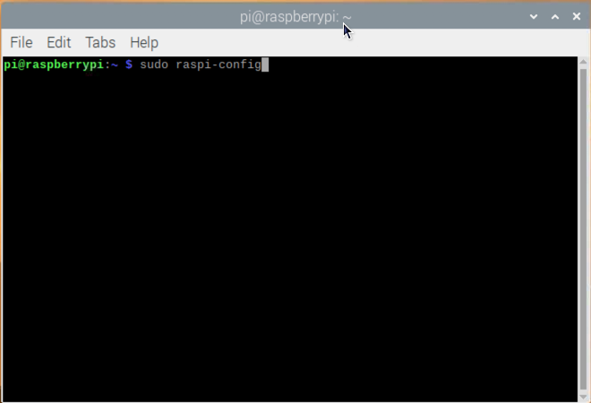
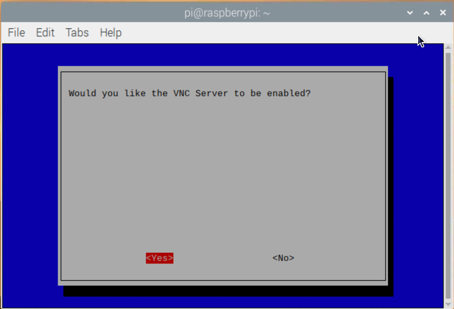
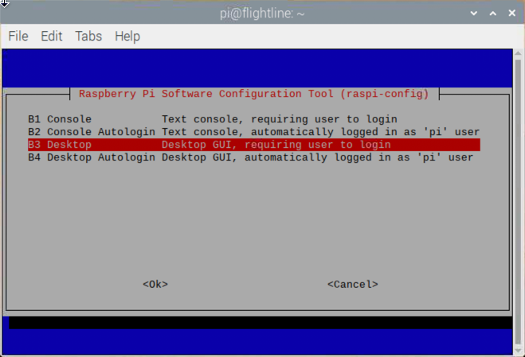

# Installing Flightline.

This document describes the process to configure a Raspberry Pi (rPi) with the appropriate OS and dependency software to run FlightLine.
ToDo: More blurb about FlightLine and what it does...

## Installing the Raspberry Pi OS (Raspbian) and dependencies

#### Prepare the SD card with the Rasbian SD Image.

Rasberry Pi provide some software to write the SD image.    It's called Raspberry Pi imager.

Running it you can choose the version of Raspbian you wish to install.  I recommend Raspberry Pi OS (32bit) over the lite and full versions.   It has a cut down desktop and anything else that's needed can be added.

If you have no need for the desktop and are comfortable with the Linux command line, you can choose the Lite version which is a bare unix install.

Instructions and a short video can be found here: https://www.raspberrypi.org/software/

#### Enter Initial configuration options.

After booting with the freshly created SD Card, the pi user will be logged into the desktop.
The initial config application is provided to set a few this first.


Click next.


Choose appropriate settings for country, language and timezone and click next.


Set the password for the pi user - make sure to store it somewhere safe.


If the screen is OK, click next.   Otherwise, you can adjust the settings.   It does not have to be perfect.  99% of the time you will not be using the device with a monitor.


Skip the wifi configuration for now.


Skip the update for now.

#### Set up some extra features. 


In the top left part of the screen click on the terminal app.


Enter the command:

```
sudo raspi-config
```


Select the first choice: ***System Options*** and hit enter.


Choose ***S4*** and hit enter to set a hostname.


Enter ***flightline*** and use the arrow kets to select "OK" and hit enter.


Select the 3rd option ***Interface Options***


Select ***P2 SSH*** and hit enter.


Choose ***Yes*** to enable the SSH server.


Hit enter to go back to the main menu.


Go back into the Interface options menu, select ***P3 VNC*** and hit enter.


Choose ***Yes*** to enable the SSH server.


Hit enter to go back to the main menu.


Choose ***System Options*** and hit enter


Select ***S5 Boot / Auto Login*** and hit enter.


Select ***B3 Desktop*** to disable auto-login and hit enter.


You can go back to the main menu and choose ***Finish***
The utility will ask you to reboot which you can do.

#### ToDo: Set up the default display resolution.

#### Install Docker

Next we will install docker and get it running.   Docker is like a system for controlling small processes.   Think of a wall of pigeon holes:


Each tool has it's own place..  You go to the hole and get the tool you need for a particular task.
Well docker is the pigeonhole cabinet, and the tools are the components we need, like a web server, database server, app server.

The alternative is having all the tools on your desk...   It still works but sometimes the tools get in the way of each other.

So, open up your favourite SSH client and connect to the rPi.

- Putty is good and simple - https://www.chiark.greenend.org.uk/~sgtatham/putty/latest.html
- MobaXTerm is also excellent and includes file/transfer software built in - https://mobaxterm.mobatek.net/
- If you are on a Mac, you can run ssh directly from the terminal.

Docker's instructions for installing Docker are here: https://www.docker.com/blog/getting-started-with-docker-for-arm-on-linux/

I've copied them for this document.

First off, run the update/upgrade commands.
```
pi@flightline:~$ sudo apt-get update
Get:1 http://archive.raspberrypi.org/debian buster InRelease [32.9 kB]
Get:2 http://archive.raspberrypi.org/debian buster/main armhf Packages [367 kB]
Get:3 http://raspbian.raspberrypi.org/raspbian buster InRelease [15.0 kB]
Get:4 http://raspbian.raspberrypi.org/raspbian buster/main armhf Packages [13.0 MB]
Get:5 http://raspbian.raspberrypi.org/raspbian buster/non-free armhf Packages [104 kB]
Fetched 13.5 MB in 38s (358 kB/s)
Reading package lists... Done

pi@flightline:~$ sudo apt-get upgrade
Reading package lists... Done
Building dependency tree
Reading state information... Done
Calculating upgrade... Done
The following packages will be upgraded:
  agnostics base-files bind9-host bluez-firmware ca-certificates 
  chromium-browser chromium-browser-l10n chromium-codecs-ffmpeg-extra device-tree-compiler
  file firmware-atheros firmware-brcm80211 firmware-libertas firmware-misc-nonfree 
  firmware-realtek gstreamer1.0-plugins-bad iproute2 libbind9-161
  libblockdev-fs2 libblockdev-loop2 libblockdev-part-err2 libblockdev-part2 
  libblockdev-swap2 libblockdev-utils2 libblockdev2 libdns-export1104 libdns1104
  libgnutls30 libgstreamer-plugins-bad1.0-0 libisc-export1100 libisc1100 
  libisccc161 libisccfg163 libjavascriptcoregtk-4.0-18 libldap-2.4-2 libldap-common
  liblwres161 libmagic-mgc libmagic1 libpam-systemd libraspberrypi-bin 
  libraspberrypi-dev libraspberrypi-doc libraspberrypi0 libsnmp-base libsnmp30
  libssl1.1 libsystemd0 libtiff5 libudev1 libvlc-bin libvlc5 libvlccore9 
  libwebkit2gtk-4.0-37 libzstd1 lxplug-bluetooth lxplug-volumepulse openssl pcmanfm
  piclone piwiz pprompt python-rpi.gpio python3-pygments python3-rpi.gpio 
  raspberrypi-bootloader raspberrypi-kernel raspberrypi-sys-mods raspi-config
  rc-gui rp-prefapps rpi-chromium-mods rpi-eeprom rpi.gpio-common sudo 
  systemd systemd-sysv thonny tzdata udev unzip vlc vlc-bin vlc-data vlc-l10n
  vlc-plugin-base vlc-plugin-notify vlc-plugin-qt vlc-plugin-samba vlc-plugin-skins2 
  vlc-plugin-video-output vlc-plugin-video-splitter
  vlc-plugin-visualization xserver-common xserver-xorg-core
95 upgraded, 0 newly installed, 0 to remove and 0 not upgraded.
Need to get 300 MB of archives.
After this operation, 13.5 MB of additional disk space will be used.
Do you want to continue? [Y/n]
```
Hit Y then enter.   It will take a few minutes, grab a coffee.

```
Get:1 http://archive.raspberrypi.org/debian buster/main armhf xserver-common all 2:1.20.4-1 [2,235 kB]
Get:2 http://mirror.internode.on.net/pub/raspbian/raspbian buster/main armhf base-files armhf 10.3 [70.1 kB]
.
.
.
Get:93 http://archive.raspberrypi.org/debian buster/main armhf vlc-plugin-samba armhf 3.0.12-0 [127 kB]
Get:94 http://archive.raspberrypi.org/debian buster/main armhf vlc-plugin-video-splitter armhf 3.0.12 [140 kB]
Get:95 http://archive.raspberrypi.org/debian buster/main armhf vlc-plugin-visualization armhf 3.0.12 [142 kB]
Fetched 300 MB in 10min 17s (485 kB/s)
Reading changelogs...
.
.
.
Processing triggers for ca-certificates (20200601~deb10u2) ...
Updating certificates in /etc/ssl/certs...
0 added, 0 removed; done.
Running hooks in /etc/ca-certificates/update.d...
done.
Processing triggers for libvlc-bin:armhf (3.0.12-0+deb10u1+rpt1) ...
pi@flightline:~$
```

It's important, after a kernel upgrade, to reboot the rPi.    Otherwise you will get an error when Docker starts up and tries to use iptables.
```
pi@flightline:~$ sudo reboot
```


Next, download the docker installer.
```
pi@flightline:~$ curl -fsSL test.docker.com -o get-docker.sh && sh get-docker.sh

blah blah missing the output of these commands...
```

Finally, add the pi user to the list of users who can execute docker commands.
```
pi@flightline:~ $ sudo usermod -aG docker pi
```
Make sure you log out and log in again for this to take effect.

Docker should now be installed.   You can test in the following way:
```
pi@flightline:~ $ docker run --rm hello-world
Unable to find image 'hello-world:latest' locally
latest: Pulling from library/hello-world
4ee5c797bcd7: Pull complete
Digest: sha256:308866a43596e83578c7dfa15e27a73011bdd402185a84c5cd7f32a88b501a24
Status: Downloaded newer image for hello-world:latest

Hello from Docker!
This message shows that your installation appears to be working correctly.

To generate this message, Docker took the following steps:
 1. The Docker client contacted the Docker daemon.
 2. The Docker daemon pulled the "hello-world" image from the Docker Hub.
    (arm32v7)
 3. The Docker daemon created a new container from that image which runs the
    executable that produces the output you are currently reading.
 4. The Docker daemon streamed that output to the Docker client, which sent it
    to your terminal.

To try something more ambitious, you can run an Ubuntu container with:
 $ docker run -it ubuntu bash

Share images, automate workflows, and more with a free Docker ID:
 https://hub.docker.com/

For more examples and ideas, visit:
 https://docs.docker.com/get-started/
```


We will also need docker-compose, a helper script for Docker.   

```
pi@flightline:~# sudo apt-get install -y docker-compose
Reading package lists... Done
Building dependency tree
Reading state information... Done
The following additional packages will be installed:
  cgroupfs-mount golang-docker-credential-helpers python3-cached-property python3-docker 
  python3-dockerpty python3-dockerpycreds python3-docopt python3-jsonschema python3-texttable 
  python3-websocket python3-yaml
Suggested packages:
  python-jsonschema-doc
Recommended packages:
  docker.io
The following NEW packages will be installed:
  cgroupfs-mount docker-compose golang-docker-credential-helpers python3-cached-property 
  python3-docker python3-dockerpty python3-dockerpycreds python3-docopt python3-jsonschema 
  python3-texttable python3-websocket python3-yaml
0 upgraded, 12 newly installed, 0 to remove and 0 not upgraded.
Need to get 915 kB of archives.
After this operation, 3,774 kB of additional disk space will be used.
Get:1 http://mirror.internode.on.net/pub/raspbian/raspbian buster/main armhf cgroupfs-mount all 1.4 [6,276 B]
.
.
.
Get:11 http://mirror.internode.on.net/pub/raspbian/raspbian buster/main armhf python3-yaml armhf 3.13-2 [111 kB]
Get:12 http://mirror.internode.on.net/pub/raspbian/raspbian buster/main armhf docker-compose all 1.21.0-3 [108 kB]
Fetched 915 kB in 10s (88.6 kB/s)
Selecting previously unselected package cgroupfs-mount.
(Reading database ... 98843 files and directories currently installed.)
Preparing to unpack .../00-cgroupfs-mount_1.4_all.deb ...
Unpacking cgroupfs-mount (1.4) ...
Selecting previously unselected package python3-cached-property.
.
.
.
Setting up docker-compose (1.21.0-3) ...
Processing triggers for man-db (2.8.5-2) ...
Processing triggers for systemd (241-7~deb10u6+rpi1) ...
```

#### Configure the WIFI access point

We need to turn the rPi into a wifi access point.    You should pick a network address that's different to your own home local address range.   Traditionally, the notaumatics were in the 192.168.100.0 netowrk,  in our case below we are going to use the network 192.168.50.0.

First, we will need some extra software installed.

##### Install Hostapd and DNSMasq

```
pi@flightline:~ $ sudo apt-get install -y hostapd dnsmasq
Reading package lists... Done
Building dependency tree
Reading state information... Done
The following additional packages will be installed:
  dns-root-data dnsmasq-base
The following NEW packages will be installed:
  dns-root-data dnsmasq dnsmasq-base hostapd
0 upgraded, 4 newly installed, 0 to remove and 0 not upgraded.
Need to get 1,050 kB of archives.
After this operation, 2,666 kB of additional disk space will be used.
Get:1 http://archive.raspberrypi.org/debian buster/main armhf dnsmasq-base armhf 2.80-1+rpt1+deb10u1 [400 kB]
Get:3 http://archive.raspberrypi.org/debian buster/main armhf dnsmasq all 2.80-1+rpt1+deb10u1 [16.5 kB]
.
.
.
Processing triggers for man-db (2.8.5-2) ...
Processing triggers for dbus (1.12.20-0+deb10u1) ...
pi@flightline:~ $
```

Stop the services so we can do extra config.

```
pi@flightline:~ $ sudo systemctl stop hostapd
pi@flightline:~ $ sudo systemctl stop dnsmasq
```

Edit the networking config and give the rPi wireless interface it's own static IP.

```
pi@flightline:~ $ sudo nano /etc/dhcpcd.conf
```

Use the arrow keys to go to the end of the file and enter the following lines:

**Note:** If you don't want to or cannot use 192.168.50.0, then change 192.168.50.1/24 to the appropriate network and address you wish to use. 

```
interface wlan0
static ip_address=192.168.50.1/24
denyinterfaces eth0
denyinterfaces wlan0
```

The file will look like this:


Hitting Ctrl-X then Y and enter will save the file.


##### Now set up dnsmasq

```
pi@flightline:~ $ sudo mv /etc/dnsmasq.conf /etc/dnsmasq.conf.orig
pi@flightline:~ $ sudo nano /etc/dnsmasq.conf
```

The file contents should be:  (Again, 192.168.50 should reflect the network you are using)

```
domain=imacresults.info
address=/flightline.imacresults.info/notauscore.imacresults.info/192.168.50.1

interface=wlan0
  dhcp-range=192.168.50.10,192.168.50.254,255.255.255.0,4h
```

Save with Ctrl-X, Y and enter


##### Next edit the hosted.conf

```
pi@flightline:~ $ sudo nano /etc/hostapd/hostapd.conf
```

The file should look like this:

```
interface=wlan0
hw_mode=g
channel=7
driver=nl80211
wmm_enabled=1
ht_capab=[HT40][SHORT-GI-20][DSSS_CCK-40]
macaddr_acl=0
auth_algs=1
ignore_broadcast_ssid=0
wpa=2
wpa_key_mgmt=WPA-PSK
wpa_pairwise=TKIP
rsn_pairwise=CCMP
ssid=ffam-notaumatic
wpa_passphrase=citamuaton
```

Save with Ctrl-X, Y and enter


Tell hostapd to load the config file:

```
pi@flightline:~ $ sudo nano /etc/default/hostapd
```

Find the line starting with DAEMON_CONF and change it to the following:

**Note:** Make sure you remove the # at the start of the line.

```
DAEMON_CONF="/etc/hostapd/hostapd.conf"
```


This stuff is probably not needed...

~~Next, we neet to turn on traffic forwarding:~~

```
pi@flightline:~ $ sudo nano /etc/sysctl.conf
```

~~Find the line "#net.ipv4.ip_forward=1" and uncomment it.  **Note:** In nano, you can use Ctrl-W to search~~

~~Save with Ctrl-X, Y and enter.~~


##### Restart everything

Best way to try this is to reboot the device.


## Copy Flightline sources


```
pi@flightline:~ $ sudo mkdir /data /data/volumes
pi@flightline:~ $ cd /data
pi@flightline:/data $ sudo git clone https://git.dannysplace.net/scm/score/flightline.git
Cloning into 'flightline'...
Username for 'https://git.dannysplace.net': danny
Password for 'https://danny@git.dannysplace.net':
fatal: Authentication failed for 'https://git.dannysplace.net/scm/score/flightline.git/'
pi@flightline:/data $ sudo git clone https://git.dannysplace.net/scm/score/flightline.git
Cloning into 'flightline'...
remote: Enumerating objects: 310, done.
remote: Counting objects: 100% (310/310), done.
remote: Compressing objects: 100% (285/285), done.
remote: Total 310 (delta 91), reused 0 (delta 0), pack-reused 0
Receiving objects: 100% (310/310), 51.73 KiB | 913.00 KiB/s, done.
Resolving deltas: 100% (91/91), done.

pi@flightline:/data $ cd /data/volumes/
pi@flightline:/data/volumes $ sudo git clone https://git.dannysplace.net/scm/score/score-flightline-node.git
Cloning into 'score-flightline-node'...
remote: Enumerating objects: 5930, done.
remote: Counting objects: 100% (5930/5930), done.
remote: Compressing objects: 100% (5808/5808), done.
remote: Total 5930 (delta 2762), reused 182 (delta 80), pack-reused 0
Receiving objects: 100% (5930/5930), 9.42 MiB | 3.62 MiB/s, done.
Resolving deltas: 100% (2762/2762), done.
Checking out files: 100% (6511/6511), done.

pi@flightline:/data/volumes $ sudo ln -s score-flightline-node ./html
```

#### Install Composer

```
pi@flightline:~ sudo apt-get install -y composer
Reading package lists... Done
Building dependency tree
Reading state information... Done
The following additional packages will be installed:
  jsonlint php-cli php-common php-composer-ca-bundle php-composer-semver php-composer-spdx-licenses 
  php-composer-xdebug-handler php-json-schema php-mbstring php-psr-log php-symfony-console 
  php-symfony-debug php-symfony-filesystem php-symfony-finder php-symfony-process php7.3-cli 
  php7.3-common php7.3-json php7.3-mbstring php7.3-opcache php7.3-readline
Suggested packages:
  fossil mercurial subversion php-zip php-symfony-event-dispatcher php-symfony-lock php-pear
The following NEW packages will be installed:
  composer jsonlint php-cli php-common php-composer-ca-bundle php-composer-semver 
  php-composer-spdx-licenses php-composer-xdebug-handler php-json-schema php-mbstring php-psr-log 
  php-symfony-console php-symfony-debug php-symfony-filesystem php-symfony-finder php-symfony-process 
  php7.3-cli php7.3-common php7.3-json php7.3-mbstring php7.3-opcache php7.3-readline
0 upgraded, 22 newly installed, 0 to remove and 0 not upgraded.
Need to get 2,981 kB of archives.
After this operation, 15.5 MB of additional disk space will be used.
Get:1 http://mirror.internode.on.net/pub/raspbian/raspbian buster/main armhf php-common all 2:69 [15.0 kB]
Get:2 http://mirror.internode.on.net/pub/raspbian/raspbian buster/main armhf php7.3-common armhf [527 kB]
Get:3 http://mirror.internode.on.net/pub/raspbian/raspbian buster/main armhf php7.3-json armhf [16.2 kB]
.
.
.
Get:22 http://mirror.internode.on.net/pub/raspbian/raspbian buster/main armhf composer all 1.8.4-1 [337 kB]
Fetched 2,981 kB in 18s (168 kB/s)
Selecting previously unselected package php-common.
.
.
.
Setting up php-cli (2:7.3+69) ...
Setting up composer (1.8.4-1) ...
Processing triggers for man-db (2.8.5-2) ...

```

Now install the flightline dependencies.

```
pi@flightline:/data/volumes/score-flightline-node $ sudo chown -R pi:pi .
pi@flightline:/data/volumes/score-flightline-node $ composer install
Loading composer repositories with package information
Warning from https://repo.packagist.org: You are using an outdated version of Composer. Composer 2 is now available and you should upgrade. See https://getcomposer.org/2
Updating dependencies (including require-dev)
Package operations: 2 installs, 0 updates, 0 removals
  - Installing psr/log (1.1.3): Downloading (100%)
  - Installing katzgrau/klogger (dev-master de2d3ab): Cloning de2d3ab677 from cache
Writing lock file
Generating autoload files
pi@flightline:/data/volumes/score-flightline-node $ sudo chown -R www-data:www-data db log api/?
```

We also need sqlite3 sometimes...

```
root@flightline:~# apt-get install -y sqlite3
Reading package lists... Done
Building dependency tree
Reading state information... Done
Suggested packages:
  sqlite3-doc
The following NEW packages will be installed:
  sqlite3
0 upgraded, 1 newly installed, 0 to remove and 0 not upgraded.
Need to get 839 kB of archives.
After this operation, 2,278 kB of additional disk space will be used.
Get:1 http://mirror.internode.on.net/pub/raspbian/raspbian buster/main armhf sqlite3 armhf [839 kB]
Fetched 839 kB in 2s (479 kB/s)
Selecting previously unselected package sqlite3.
(Reading database ... 101014 files and directories currently installed.)
Preparing to unpack .../sqlite3_3.27.2-3+deb10u1_armhf.deb ...
Unpacking sqlite3 (3.27.2-3+deb10u1) ...
Setting up sqlite3 (3.27.2-3+deb10u1) ...
Processing triggers for man-db (2.8.5-2) ...
```

